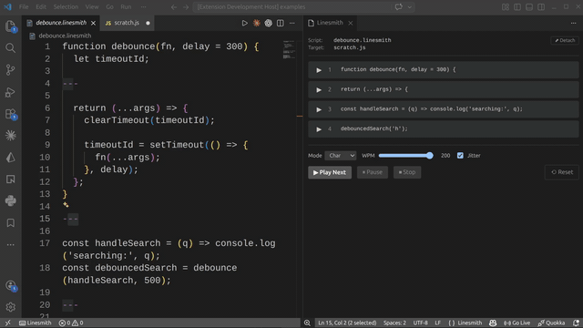

# Linesmith

A VS Code / Cursor / Windsurf extension that types code into the active editor on cue — clean playback, no autocomplete fights. Built so recording tutorials stops being a typo-and-retake loop.



## Install

| Editor | Source |
| --- | --- |
| VS Code | Search **Linesmith** in the Extensions panel |
| Cursor / Windsurf / VSCodium | Search **Linesmith** (resolves via Open VSX) |
| GitHub | [bradtraversy/linesmith](https://github.com/bradtraversy/linesmith) |

## Usage

### `.linesmith` script files

Scripts are plain text with `---` on its own line separating chunks. Edit them in a normal VS Code tab:

```
import { useState } from 'react';

---

function Counter() {
  const [n, setN] = useState(0);
  return <button onClick={() => setN(n + 1)}>{n}</button>;
}

---

export default Counter;
```

Three chunks, played one at a time.

### Talking-point notes (`@note`)

Add `@note` lines at the top of a chunk to attach talking points that show in the panel but never get typed into the target. Stack as many as you want — they render under the chunk preview as a reminder of what to say while typing.

```
@note Set the scene — debouncing is the classic search-input problem
@note Closure point: timeoutId persists across calls

function debounce(fn, delay = 300) {
  let timeoutId;
  ...
}
```

The first blank or non-`@` line ends the directive block; everything after that is the body that gets typed.

### The recording flow

1. Open your `.linesmith` script in one tab
2. Click into the code file you want to type into — that becomes the target
3. Run **Linesmith: Open Panel** (command palette)
4. Hit **Play Next** (or `ctrl+alt+l` / `cmd+alt+l`) to type the next chunk

The target editor is whichever non-`.linesmith` tab you last clicked into. The panel shows it in the header so it's never ambiguous.

### Countdown before playback

Optional 3-second or 5-second pre-roll before Play Next starts typing — gives you time to finish narrating the lead-in before characters appear. Toggle via the **Countdown** dropdown in the panel, or set a default with `linesmith.defaultCountdown`. Off by default; the clipboard fast path always skips countdown.

### Re-arm from any chunk

Hover a chunk card and click the **⏮** button to mark earlier chunks as played and this chunk + all later as un-played. Useful when a take goes wrong partway through — `Ctrl+Z` in the target to undo the bad code, click ⏮ on the chunk to restart from, then hit Play Next.

### Clipboard fast path

For one-off blocks: copy code anywhere, focus the target editor, hit `ctrl+alt+shift+l` (or `cmd+alt+shift+l`). Types the clipboard contents at the cursor.

## Commands

| Command | Default shortcut |
| --- | --- |
| Linesmith: Open Panel | (command palette) |
| Linesmith: New Script | (command palette) |
| Linesmith: Play Next Chunk | `ctrl+alt+l` / `cmd+alt+l` |
| Linesmith: Play From Clipboard | `ctrl+alt+shift+l` / `cmd+alt+shift+l` |
| Linesmith: Pause / Resume | (status bar click) |
| Linesmith: Stop | `ctrl+alt+escape` / `cmd+alt+escape` |

## Settings

| Setting | Default | Notes |
| --- | --- | --- |
| `linesmith.defaultMode` | `char` | `instant` / `line` / `char` |
| `linesmith.defaultWpm` | `80` | char mode speed (20–300) |
| `linesmith.defaultJitter` | `true` | adds human-like timing variance |
| `linesmith.defaultLineDelayMs` | `120` | pause between lines in line mode |
| `linesmith.defaultCountdown` | `0` | seconds before Play Next starts typing (`0` / `3` / `5`) |

## How it works

Linesmith uses the VS Code Extension API directly (`TextEditor.edit()`) rather than injecting keystrokes. That sidesteps autocomplete, bracket auto-close, snippets, and `formatOnType` — and works in remote sessions (SSH, WSL, Codespaces) where keystroke injection often can't reach.

## Roadmap

- **v0.1** (this release) — typing engine, `.linesmith` files, panel, clipboard hotkey, language contribution
- **v0.2** — cursor choreography: per-chunk `@directive` frontmatter (`@cursor end-of-line`, `@speed 60`)
- **v0.3** — pause-on-marker (`{{pause}}` tokens that wait for a keyboard cue)
- **v0.4** — typo-and-correction simulation
- **v0.5** — multi-file scripts
- **v1.0** — record-and-replay

## License

MIT
